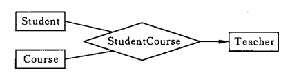

# 一、事务

## 概念

事务指的是满足 ACID 特性的一组操作，可以通过 Commit 提交一个事务，也可以使用 Rollback 进行回滚。

<div align="center">  </div><br>

## ACID

### 1. 原子性（Atomicity）

事务被视为不可分割的最小单元，事务的所有操作要么全部提交成功，要么全部失败回滚。

回滚可以用回滚日志来实现，回滚日志记录着事务所执行的修改操作，在回滚时反向执行这些修改操作即可。

==也即：数据库事务的原子性通过日志实现。==

### 2. 一致性（Consistency）

数据库在事务执行前后都保持一致性状态。在一致性状态下，所有事务对一个数据的读取结果都是相同的。

### 3. 隔离性（Isolation）

一个事务所做的修改在最终提交以前，对其它事务是不可见的。

### 4. 持久性（Durability）

一旦事务提交，则其所做的修改将会永远保存到数据库中。即使系统发生崩溃，事务执行的结果也不能丢失。

使用重做日志来保证持久性。

----

事务的 ACID 特性概念简单，但不是很好理解，主要是因为这几个特性不是一种平级关系：

- 只有满足一致性，事务的执行结果才是正确的。
- 在无并发的情况下，事务串行执行，隔离性一定能够满足。此时只要能满足原子性，就一定能满足一致性。
- ==在并发的情况下，多个事务并行执行，事务不仅要满足原子性，还需要满足隔离性，才能满足一致性。==
- 事务满足持久化是为了能应对数据库崩溃的情况。

<div align="center">  </div><br>

## AUTOCOMMIT

MySQL 默认采用自动提交模式。也就是说，如果不显式使用`START TRANSACTION`语句来开始一个事务，那么每个查询都会被当做一个事务自动提交。

# 二、并发一致性问题

在并发环境下，事务的隔离性很难保证，因此会出现很多并发一致性问题。

## 丢失修改

T<sub>1</sub> 和 T<sub>2</sub> 两个事务都对一个数据进行修改，T<sub>1</sub> 先修改，T<sub>2</sub> 随后修改，T<sub>2</sub> 的修改覆盖了 T<sub>1</sub> 的修改。

<div align="center">  </div><br>

## 读脏数据

T<sub>1</sub> 修改一个数据，T<sub>2</sub> 随后读取这个数据。如果 T<sub>1</sub> 撤销了这次修改，那么 T<sub>2</sub> 读取的数据是脏数据。

<div align="center">  </div><br>

## 不可重复读

T<sub>2</sub> 读取一个数据，T<sub>1</sub> 对该数据做了修改。如果 T<sub>2</sub> 再次读取这个数据，此时读取的结果和第一次读取的结果不同。

==即：读到了T2对数据的update 和delete 等修改操作==

<div align="center">  </div><br>


## 幻影读

T<sub>1</sub> 读取某个范围的数据，T<sub>2</sub> 在这个范围内插入新的数据，T<sub>1</sub> 再次读取这个范围的数据，此时读取的结果和和第一次读取的结果不同。

幻读关键在于插入操作insert；T2进行了插入，然后提交，之后T1读到了之前不存在的数据行；因为只加行锁，在；

<div align="center">  </div><br>

----

产生并发不一致性问题主要原因是破坏了事务的隔离性，解决方法是通过并发控制来保证隔离性。并发控制可以通过封锁来实现，但是封锁操作需要用户自己控制，相当复杂。数据库管理系统提供了事务的隔离级别，让用户以一种更轻松的方式处理并发一致性问题。

# 三、封锁

## 封锁粒度

MySQL 中提供了两种封锁粒度：行级锁以及表级锁。（InnoDB都支持）

应该尽量只锁定需要修改的那部分数据，而不是所有的资源。锁定的数据量越少，发生锁争用的可能就越小，系统的并发程度就越高。

但是加锁需要消耗资源，锁的各种操作（包括获取锁、释放锁、以及检查锁状态）都会增加系统开销。因此封锁粒度越小，系统开销就越大。

在选择封锁粒度时，需要在锁开销和并发程度之间做一个权衡。

<div align="center">  </div><br>

## 封锁类型

### 1. 读写锁

- 排它锁（Exclusive），简写为 X 锁，又称写锁。
- 共享锁（Shared），简写为 S 锁，又称读锁。

有以下两个规定：

- 一个事务对数据对象 A 加了 X 锁，就可以对 A 进行读取和更新。加锁期间其它事务不能对 A 加任何锁。
- 一个事务对数据对象 A 加了 S 锁，可以对 A 进行读取操作，但是不能进行更新操作。加锁期间其它事务能对 A 加 S 锁，但是不能加 X 锁。

锁的兼容关系如下：

| - | X | S |
| :--: | :--: | :--: |
|X|×|×|
|S|×|√|

### 2. 意向锁

使用意向锁（Intention Locks）可以更容易地支持多粒度封锁。

在存在行级锁和表级锁的情况下，事务 T 想要对表 A 加 X 锁，就需要先检测是否有其它事务对表 A 或者表 A 中的任意一行加了锁，那么就需要对表 A 的每一行都检测一次，这是非常耗时的。

意向锁在原来的 X/S 锁之上引入了 IX/IS，IX/IS 都是表锁，用来表示一个事务想要在表中的某个数据行上加 X 锁或 S 锁。有以下两个规定：

- 一个事务在获得某个数据行对象的 S 锁之前，必须先获得表的 IS 锁或者更强的锁；
- 一个事务在获得某个数据行对象的 X 锁之前，必须先获得表的 IX 锁。

通过引入意向锁，事务 T 想要对表 A 加 X 锁，只需要先检测是否有其它事务对表 A 加了 X/IX/S/IS 锁，如果加了就表示有其它事务正在使用这个表或者表中某一行的锁，因此事务 T 加 X 锁失败。

各种锁的兼容关系如下：

| - | X | IX | S | IS |
| :--: | :--: | :--: | :--: | :--: |
|X     |×    |×    |×   | ×|
|IX    |×    |√   |×   | √|
|S     |×    |×    |√  | √|
|IS    |×    |√  |√  | √|

解释如下：

- 任意 IS/IX 锁之间都是兼容的，因为它们只是表示想要对表加锁，而不是真正加锁；
- S 锁只与 S 锁和 IS 锁兼容，也就是说事务 T 想要对数据行加 S 锁，其它事务可以已经获得对表或者表中的行的 S 锁。

## 封锁协议

### 1. 三级封锁协议

**一级封锁协议** 

事务 T 要修改数据 A 时必须加 X 锁，直到 T 结束才释放锁。

可以解决丢失修改问题，因为不能同时有两个事务对同一个数据进行修改，那么事务的修改就不会被覆盖。

| T<sub>1</sub> | T<sub>2</sub> |
| :--: | :--: |
| lock-x(A) | |
| read A=20 | |
| | lock-x(A) |
|  | wait |
| write A=19 |. |
| commit |. |
| unlock-x(A) |. |
| | obtain |
| | read A=19 |
| | write A=21 |
| | commit |
| | unlock-x(A)|

**二级封锁协议** 

在一级的基础上，要求读取数据 A 时必须加 S 锁，读取完马上释放 S 锁。

可以解决读脏数据问题，因为如果一个事务在对数据 A 进行修改，根据 1 级封锁协议，会加 X 锁，那么就不能再加 S 锁了，也就是不会读入数据。

| T<sub>1</sub> | T<sub>2</sub> |
| :--: | :--: |
| lock-x(A) | |
| read A=20 | |
| write A=19 | |
| | lock-s(A) |
|  | wait |
| rollback | .|
| A=20 |. |
| unlock-x(A) |. |
| | obtain |
| | read A=20 |
| | unlock-s(A)|
| | commit |

**三级封锁协议** 

在二级的基础上，要求读取数据 A 时必须加 S 锁，直到事务结束了才能释放 S 锁。

可以解决不可重复读的问题，因为读 A 时，其它事务不能对 A 加 X 锁，从而避免了在读的期间数据发生改变。

| T<sub>1</sub> | T<sub>2</sub> |
| :--: | :--: |
| lock-s(A) | |
| read A=20 | |
|  |lock-x(A) |
| | wait |
|  read A=20| . |
| commit | .|
| unlock-s(A) |. |
| | obtain |
| | read A=20 |
| | write A=19|
| | commit |
| | unlock-X(A)|

### 2. 两段锁协议

加锁和解锁分为两个阶段进行。

可串行化调度是指，通过并发控制，使得并发执行的事务结果与某个串行执行的事务结果相同。

事务遵循两段锁协议是保证可串行化调度的充分条件。例如以下操作满足两段锁协议，它是可串行化调度。

```html
lock-x(A)...lock-s(B)...lock-s(C)...unlock(A)...unlock(C)...unlock(B)
```

但不是必要条件，例如以下操作不满足两段锁协议，但是它还是可串行化调度。

```html
lock-x(A)...unlock(A)...lock-s(B)...unlock(B)...lock-s(C)...unlock(C)
```

## MySQL 隐式与显示锁定

MySQL 的 InnoDB 存储引擎采用两段锁协议，会根据隔离级别在需要的时候自动加锁，并且所有的锁都是在同一时刻被释放，这被称为隐式锁定。

InnoDB 也可以使用特定的语句进行显示锁定：

```sql
SELECT ... LOCK In SHARE MODE;
SELECT ... FOR UPDATE;
```

# 四、隔离级别

## 未提交读（READ UNCOMMITTED）

事务中的修改，即使没有提交，对其它事务也是可见的。

## 提交读（READ COMMITTED）

一个事务只能读取已经提交的事务所做的修改。换句话说，一个事务所做的修改在提交之前对其它事务是不可见的。

## 可重复读（REPEATABLE READ）

保证在同一个事务中多次读取同样数据的结果是一样的。

## 可串行化（SERIALIZABLE）

强制事务串行执行。

----

| 隔离级别 | 脏读 | 不可重复读 | 幻影读 | 加锁读 |
| :---: | :---: | :---:| :---: | :---: |
| 未提交读 | √ | √ | √ | × |
| 提交读 | × | √ | √ | × |
| 可重复读 | × | × | √ | × |
| 可串行化 | × | × | × | √ |

# 五、多版本并发控制

==多版本并发控制==（Multi-Version Concurrency Control, MVCC）是 MySQL 的 InnoDB 存储引擎实现隔离级别的一种具体方式，==用于实现提交读和可重复读这两种隔离级别==。而未提交读隔离级别总是读取最新的数据行，无需使用 MVCC。可串行化隔离级别需要对所有读取的行都加锁，单纯使用 MVCC 无法实现。

## 版本号

- 系统版本号：是一个递增的数字，每开始一个新的事务，系统版本号就会自动递增。
- 事务版本号：事务开始时的系统版本号。

## 隐藏的列

MVCC 在每行记录后面都保存着两个隐藏的列，用来存储两个版本号：

- 创建版本号：指示创建一个数据行的快照时的系统版本号；
- 删除版本号：如果该快照的删除版本号大于当前事务版本号表示该快照有效，否则表示该快照已经被删除了。

## Undo 日志

MVCC 使用到的快照存储在 Undo 日志中，该日志通过回滚指针把一个数据行（Record）的所有快照连接起来。

<div align="center">  </div><br>

## 实现过程

以下实现过程针对**可重复读隔离级别**。

==当开始新一个事务时，该事务的版本号肯定会大于当前所有数据行快照的创建版本号，理解这一点很关键。==

### 1. SELECT

多个事务必须读取到同一个数据行的快照，并且这个快照是距离现在最近的一个有效快照。但是也有例外，如果有一个事务正在修改该数据行，那么它可以读取事务本身所做的修改，而不用和其它事务的读取结果一致。

把没有对一个数据行做修改的事务称为 T，T 所要读取的数据行快照的创建版本号必须小于 T 的版本号，因为如果大于或者等于 T 的版本号，那么表示该数据行快照是其它事务的最新修改，因此不能去读取它。除此之外，T 所要读取的数据行快照的删除版本号必须大于 T 的版本号，因为如果小于等于 T 的版本号，那么表示该数据行快照是已经被删除的，不应该去读取它。

### 2. INSERT

将当前系统版本号作为数据行快照的创建版本号。

### 3. DELETE

将当前系统版本号作为数据行快照的删除版本号。

### 4. UPDATE

将当前系统版本号作为更新前的数据行快照的删除版本号，并将当前系统版本号作为更新后的数据行快照的创建版本号。可以理解为先执行 DELETE 后执行 INSERT。

## 快照读与当前读

### 1. 快照读

使用 MVCC 读取的是快照中的数据，这样可以减少加锁所带来的开销。

```sql
select * from table ...;
```

### 2. 当前读

读取的是最新的数据，需要加锁。以下第一个语句需要加 S 锁，其它都需要加 X 锁。

```sql
select * from table where ? lock in share mode;
select * from table where ? for update;
insert;
update;
delete;
```

# 六、Next-Key Locks

Next-Key Locks 是 MySQL 的 InnoDB 存储引擎的一种锁实现。

MVCC 不能解决幻读的问题，Next-Key Locks 就是为了解决这个问题而存在的。在可重复读（REPEATABLE READ）隔离级别下，使用 MVCC + Next-Key Locks 可以解决幻读问题。

## Record Locks

锁定一个记录上的索引，而不是记录本身。

如果表没有设置索引，InnoDB 会自动在主键上创建隐藏的聚簇索引，因此 Record Locks 依然可以使用。

## Gap Locks

锁定索引之间的间隙，但是不包含索引本身。例如当一个事务执行以下语句，其它事务就不能在 t.c 中插入 15。

```sql
SELECT c FROM t WHERE c BETWEEN 10 and 20 FOR UPDATE;
```

## Next-Key Locks

它是 Record Locks 和 Gap Locks 的结合，不仅锁定一个记录上的索引，也锁定索引之间的间隙。例如一个索引包含以下值：10, 11, 13, and 20，那么就需要锁定以下区间：

```sql
(negative infinity, 10]
(10, 11]
(11, 13]
(13, 20]
(20, positive infinity)
```

# 七、关系数据库设计理论

## 函数依赖

记 A->B 表示 A 函数决定 B，也可以说 B 函数依赖于 A。

如果 {A1，A2，... ，An} 是关系的一个或多个属性的集合，该集合函数决定了关系的其它所有属性并且是最小的，那么该集合就称为键码。

对于 A->B，如果能找到 A 的真子集 A'，使得 A'-> B，那么 A->B 就是部分函数依赖，否则就是完全函数依赖。

对于 A->B，B->C，则 A->C 是一个传递函数依赖。

## 异常

以下的学生课程关系的函数依赖为 Sno, Cname -> Sname, Sdept, Mname, Grade，键码为 {Sno, Cname}。也就是说，确定学生和课程之后，就能确定其它信息。

| Sno | Sname | Sdept | Mname | Cname | Grade |
| :---: | :---: | :---: | :---: | :---: |:---:|
| 1 | 学生-1 | 学院-1 | 院长-1 | 课程-1 | 90 |
| 2 | 学生-2 | 学院-2 | 院长-2 | 课程-2 | 80 |
| 2 | 学生-2 | 学院-2 | 院长-2 | 课程-1 | 100 |
| 3 | 学生-3 | 学院-2 | 院长-2 | 课程-2 | 95 |

不符合范式的关系，会产生很多异常，主要有以下四种异常：

- 冗余数据：例如 `学生-2` 出现了两次。
- 修改异常：修改了一个记录中的信息，但是另一个记录中相同的信息却没有被修改。
- 删除异常：删除一个信息，那么也会丢失其它信息。例如删除了 `课程-1` 需要删除第一行和第三行，那么 `学生-1` 的信息就会丢失。
- 插入异常：例如想要插入一个学生的信息，如果这个学生还没选课，那么就无法插入。

## 范式

范式理论是为了解决以上提到四种异常。

高级别范式的依赖于低级别的范式，1NF 是最低级别的范式。

<div align="center">  </div><br>

### 1. 第一范式 (1NF)

属性不可分。

### 2. 第二范式 (2NF)

每个非主属性完全函数依赖于键码。

可以通过分解来满足。

<font size=4> **分解前** </font><br>

| Sno | Sname | Sdept | Mname | Cname | Grade |
| :---: | :---: | :---: | :---: | :---: |:---:|
| 1 | 学生-1 | 学院-1 | 院长-1 | 课程-1 | 90 |
| 2 | 学生-2 | 学院-2 | 院长-2 | 课程-2 | 80 |
| 2 | 学生-2 | 学院-2 | 院长-2 | 课程-1 | 100 |
| 3 | 学生-3 | 学院-2 | 院长-2 | 课程-2 | 95 |

以上学生课程关系中，{Sno, Cname} 为键码，有如下函数依赖：

- Sno -> Sname, Sdept
- Sdept -> Mname
- Sno, Cname-> Grade

Grade 完全函数依赖于键码，它没有任何冗余数据，每个学生的每门课都有特定的成绩。

Sname, Sdept 和 Mname 都部分依赖于键码，当一个学生选修了多门课时，这些数据就会出现多次，造成大量冗余数据。

<font size=4> **分解后** </font><br>

关系-1

| Sno | Sname | Sdept | Mname |
| :---: | :---: | :---: | :---: |
| 1 | 学生-1 | 学院-1 | 院长-1 |
| 2 | 学生-2 | 学院-2 | 院长-2 |
| 3 | 学生-3 | 学院-2 | 院长-2 |

有以下函数依赖：

- Sno -> Sname, Sdept
- Sdept -> Mname

关系-2

| Sno | Cname | Grade |
| :---: | :---: |:---:|
| 1 | 课程-1 | 90 |
| 2 | 课程-2 | 80 |
| 2 | 课程-1 | 100 |
| 3 | 课程-2 | 95 |

有以下函数依赖：

- Sno, Cname ->  Grade

### 3. 第三范式 (3NF)

非主属性不传递函数依赖于键码。

上面的 关系-1 中存在以下传递函数依赖：

- Sno -> Sdept -> Mname

可以进行以下分解：

关系-11

| Sno | Sname | Sdept |
| :---: | :---: | :---: |
| 1 | 学生-1 | 学院-1 |
| 2 | 学生-2 | 学院-2 |
| 3 | 学生-3 | 学院-2 |

关系-12

| Sdept | Mname |
| :---: | :---: |
| 学院-1 | 院长-1 |
| 学院-2 | 院长-2 |

# 八、ER 图

Entity-Relationship，有三个组成部分：实体、属性、联系。

用来进行关系型数据库系统的概念设计。

## 实体的三种联系

包含一对一，一对多，多对多三种。

- 如果 A 到 B 是一对多关系，那么画个带箭头的线段指向 B；
- 如果是一对一，画两个带箭头的线段；
- 如果是多对多，画两个不带箭头的线段。

下图的 Course 和 Student 是一对多的关系。

<div align="center">  </div><br>

## 表示出现多次的关系

一个实体在联系出现几次，就要用几条线连接。

下图表示一个课程的先修关系，先修关系出现两个 Course 实体，第一个是先修课程，后一个是后修课程，因此需要用两条线来表示这种关系。

<div align="center">  </div><br>

## 联系的多向性

虽然老师可以开设多门课，并且可以教授多名学生，但是对于特定的学生和课程，只有一个老师教授，这就构成了一个三元联系。

<div align="center">  </div><br>

一般只使用二元联系，可以把多元联系转换为二元联系。

<div align="center">  </div><br>

## 表示子类

用一个三角形和两条线来连接类和子类，与子类有关的属性和联系都连到子类上，而与父类和子类都有关的连到父类上。

<div align="center">  </div><br>

# 九 参考资料

- AbrahamSilberschatz, HenryF.Korth, S.Sudarshan, 等. 数据库系统概念 [M]. 机械工业出版社, 2006.
- 施瓦茨. 高性能 MYSQL(第3版)[M]. 电子工业出版社, 2013.
- 史嘉权. 数据库系统概论[M]. 清华大学出版社有限公司, 2006.
- [The InnoDB Storage Engine](https://dev.mysql.com/doc/refman/5.7/en/innodb-storage-engine.html)
- [Transaction isolation levels](https://www.slideshare.net/ErnestoHernandezRodriguez/transaction-isolation-levels)
- [Concurrency Control](http://scanftree.com/dbms/2-phase-locking-protocol)
- [The Nightmare of Locking, Blocking and Isolation Levels!](https://www.slideshare.net/brshristov/the-nightmare-of-locking-blocking-and-isolation-levels-46391666)
- [Database Normalization and Normal Forms with an Example](https://aksakalli.github.io/2012/03/12/database-normalization-and-normal-forms-with-an-example.html)
- [The basics of the InnoDB undo logging and history system](https://blog.jcole.us/2014/04/16/the-basics-of-the-innodb-undo-logging-and-history-system/)
- [MySQL locking for the busy web developer](https://www.brightbox.com/blog/2013/10/31/on-mysql-locks/)
- [浅入浅出 MySQL 和 InnoDB](https://draveness.me/mysql-innodb)
- [Innodb 中的事务隔离级别和锁的关系](https://tech.meituan.com/2014/08/20/innodb-lock.html)

# 1.MySQL事务日志

## 回滚日志（undo log）

- 保证事务原子性
- 参与MVCC

想要保证事务的原子性，就需要在异常发生时，对已经执行的操作进行回滚，而在 MySQL 中，恢复机制是通过回滚日志（undo log）实现的，所有事务进行的修改都会先记录到这个回滚日志中，然后在对数据库中的对应行进行写入。

回滚日志并不能将数据库物理地恢复到执行语句或者事务之前的样子；它是逻辑日志，当回滚日志被使用时，它只会按照日志**逻辑地**将数据库中的修改撤销掉看，可以**理解**为，我们在事务中使用的每一条 `INSERT` 都对应了一条 `DELETE`，每一条 `UPDATE` 也都对应一条相反的 `UPDATE` 语句。因为存在着其他的并发事务对数据进行修改，所以不能简单的将数据物理恢复到初始状态；

## 重做日志（Redo Log ）

- 实现事务持久性

redo log包含：一是内存中的**重做日志缓冲区**，因为重做日志缓冲区在内存中，所以它是易失的；另一个就是在磁盘上的**重做日志文件**，它是持久的。


当我们在一个事务中尝试对数据进行修改时，它会先将数据从磁盘读入内存，并更新内存中缓存的数据，然后生成一条重做日志并写入重做日志缓存，当事务真正提交时，MySQL 会将重做日志缓存中的内容刷新到重做日志文件，再将内存中的数据更新到磁盘上，图中的第 4、5 步就是在事务提交时执行的。

在 InnoDB 中，重做日志都是以 512 字节的块的形式进行存储的，同时因为块的大小与磁盘扇区大小相同，所以重做日志的写入可以保证原子性，不会由于机器断电导致重做日志仅写入一半并留下脏数据。

除了所有对数据库的修改会产生重做日志，因为**回滚日志也是需要持久存储的，它们也会创建对应的重做日志**，在发生错误后，数据库重启时会从重做日志中找出未被更新到数据库磁盘中的日志重新执行以满足事务的持久性。

## 回滚日志和重做日志

MySQL中存在两种事务日志：回滚日志（undo日志）和重做日志（redo日志）在数据库系统中，事务的原子性和持久性是由事务日志（transaction log）保证的，在实现时也就是上面提到的两种日志，前者用于对事务的影响进行撤销，后者在错误处理时对已经提交的事务进行重做，它们能保证两点：

1. 发生错误或者需要回滚的事务能够成功回滚（**原子性**）；
2. 在事务提交后，数据没来得及写会磁盘就宕机时，在下次重新启动后能够成功恢复数据（**持久性**）；

在数据库中，这两种日志经常都是一起工作的，我们可以将它们整体看做一条事务日志，其中包含了**事务的 ID、修改的行元素以及修改前后的值**。一条事务日志同时包含了修改前后的值，能够非常简单的进行回滚和重做两种操作


# 2.多版本MVCC实现MySQL隔离性

## 行结构

每一行额外包含三个隐藏字段：


- DB_TRX_ID：事务ID。行的创建时间和删除时间记录的就是此值。
- DB_ROLL_PTR：指向当前记录项的undo信息。
- DB_ROW_ID:：随着新行插入单调递增的一个字段。当由innodb自动产生聚集索引时，聚集索引包括这个DB_ROW_ID的值，不然的话聚集索引中不包括这个值。

==当开始新一个事务时，该事务的版本号肯定会大于当前所有数据行快照的创建版本号，理解这一点很关键。==

- 在insert操作时，创建时间 = DB_ROW_ID，这时，“删除时间 ”是未定义的。
- 在update操作时，复制新增行的“创建时间”=DB_ROW_ID，删除时间未定义，旧数据行“创建时间”不变，删除时间=该事务的DB_ROW_ID。
- 在delete操作时，相应数据行的“创建时间”不变，删除时间 = 该事务的DB_ROW_ID。
- select操作对两者都不修改，只读相应的数据。读取创建版本号<当前事务版本号，删除版本号为空或>当前事务版本号。

## 事务链表

MySQL中的事务在开始到提交这段过程中，都会被保存到一个叫trx_sys的事务链表中（事务系统维护一个全局的list，用于记录还未committed的事务），这是一个基本的链表结构：


事务链表中保存的都是还未提交的事务，事务一旦被提交，则会被从事务链表中摘除。

## ReadView（快照）

ReadView说白了就是一个数据结构，在Select语句开始的时候被创建。这个数据结构中包含了3个主要的成员：ReadView{low_trx_id, up_trx_id, trx_ids}，在并发情况下，一个事务在启动时，trx_sys链表中存在部分还未提交的事务，那么哪些改变对当前事务是可见的，哪些又是不可见的，这个需要通过ReadView来进行判定，首先来看下ReadView中的3个成员各自代表的意思：

1. `low_trx_id`表示该Select启动时，当前事务链表中最大的事务id编号，也就是最近创建的除自身以外最大事务编号；
2. `up_trx_id`表示该Select启动时，当前事务链表中最小的事务id编号，也就是当前系统中创建最早但还未提交的事务；
3. `trx_ids`表示所有事务链表中事务的id集合。


关于low_limit_id，up_limit_id的理解：（就是low_trx_id，up_trx_id）

- up_limit_id：当前已经提交的事务号 + 1，事务号 < up_limit_id ，对于当前Read View都是可见的。理解起来就是创建Read View视图的时候，之前已经提交的事务对于该事务肯定是可见的。
- low_limit_id：当前最大的事务号 + 1，事务号 >= low_limit_id，对于当前Read View都是不可见的。理解起来就是在创建Read View视图之后创建的事务对于该事务肯定是不可见的。（==注意这个low_limit_id=未开启的事务id=当前最大事务id+1==）

另外，trx_ids为活跃事务id列表，即Read View初始化时当前未提交的事务列表。所以当进行RR读的时候，trx_ids中的事务对于本事务是不可见的（除了自身事务，自身事务对于表的修改对于自己当然是可见的）。理解起来就是创建RV时，将当前活跃事务ID记录下来，后续即使他们提交对于本事务也是不可见的。

### ReadView创建时机

另外, 对于read view快照的生成时机, 也非常关键, **正是因为生成时机的不同, 造成了RC,RR两种隔离级别的不同可见性**;

- 在innodb中(默认repeatable read级别), 事务在begin/start transaction之后的第一条select读操作后, 会创建一个快照(read view), 将当前系统中活跃的其他事务记录记录起来;
- 在innodb中(默认repeatable committed级别), 事务中每条select语句都会创建一个快照(read view);

## Undo Log

- Undo log是InnoDB MVCC事务特性的重要组成部分。**当我们对记录做了变更操作时就会产生undo记录**，Undo记录默认被记录到系统表空间(ibdata)中，但从5.6开始，也可以使用独立的Undo 表空间。
- Undo记录中存储的是老版本数据，当一个旧的事务需要读取数据时，为了能读取到老版本的数据，需要顺着undo链找到满足其可见性的记录。当版本链很长时，通常可以认为这是个比较耗时的操作

## 可见性比较算法

设要读取的行的最后提交事务id(即当前数据行的稳定事务id)为 `trx_id_current`
当前新开事务id为 `new_id`
当前新开事务创建的快照`read view` 中最早的事务id为`up_limit_id`, 最迟的事务id为`low_limit_id`

- 1.`trx_id_current < up_limit_id`, 这种情况比较好理解, 表示, 新事务在读取该行记录时, 该行记录的稳定事务ID是小于, 系统当前所有活跃的事务, 所以当前行稳定数据对新事务可见, 跳到步骤5.

- 2.`trx_id_current >= low_limit_id`, 这种情况也比较好理解, 表示, 数据行在当前事务启动后被修改，对当前事务不可见。该行记录的稳定事务id是在本次新事务创建之后才开启的，所以该行记录的当前值不可见, 跳到步骤4。

- 3.`up_limit_id<= trx_id_current <= low_limit_id`, 表示: 该行记录所在事务在本次新事务创建的时候处于活动状态，从`up_limit_id`到`low_limit_id`进行遍历，如果`trx_id_current`等于他们之中的某个事务id的话，那么不可见, 跳到步骤4，**否则表示可见**（比如`trx_sys`为[4,8]；区间内有一个`trx_id_current=5.5`的事务，但是它在创建ReadView时候就已经提交了。在RR隔离级别下，对于这种情况是不可见的；而对于RC级别，则是可见的；而对于处于[4,8]区间的`trx_sys`中的trxi（表示`trx_sys`list中保存的事务），则对RC，RR都不可见，因为这些都是没有提交的事务）。==这里关键点在于，判断的时候是按照`trx_id_current`是否在[up_limit_id, low_limit_id]区间判断的；而ReadView则是保存的一个个事务号，是离散的，所以要判断在这个中间是否有已经提交的事务。==

- 4.从该行记录的 `DB_ROLL_PTR` 指针所指向的回滚段中取出最新的`undo-log的版本号`, 将它赋值该 `trx_id_current`，然后跳到步骤1重新开始判断。

- 5.将该可见行的值返回。

  

## 快照读与当前读

- MySQL的InnoDB存储引擎默认事务隔离级别是RR(可重复读), 是通过 ==Next-Key-Lock("行排他锁+MVCC")== 一起实现的, 不仅可以保证可重复读, 还可以**部分**防止幻读, 而非完全防止;
- 为什么是部分防止幻读, 而不是完全防止?
  - 效果: 在如果事务B在事务A执行中, insert了一条数据并提交, 事务A再次查询, 虽然读取的是undo中的旧版本数据(防止了部分幻读), 但是事务A中执行update或者delete都是可以成功的!!
  - 因为在innodb中的操作可以分为`当前读(current read)`和`快照读(snapshot read)`:

### 1. 快照读

使用 MVCC 读取的是快照中的数据，这样可以减少加锁所带来的开销。使用简单的select语句；

```sql
select * from table ...;（不包括select...for update这种）
```

### 2. 当前读

读取的是最新的数据，需要加锁。以下第一个语句需要加 S 锁，其它都需要加 X 锁。

**InnoDB引擎在加锁的时候，只有通过索引进行检索的时候才会使用行级锁，否则会使用表级锁。**这里我们希望使用行级锁，就要给method_name添加索引，值得注意的是，这个索引一定要创建成唯一索引，否则会出现多个重载方法之间无法同时被访问的问题。重载方法的话建议把参数类型也加上。

我们可以认为获得排它锁的线程即可获得分布式锁

```sql
select * from table where ? lock in share mode;
select * from table where ? for update;
insert;
update;
delete;
```

在RR级别下，快照读是通过MVVC(多版本控制)和undo log来实现的，当前读是通过加record lock(记录锁)和gap lock(间隙锁)来实现的。

总结：RR级别下，在读的时候（简单的select语句）采用通过MVCC+undo实现的快照读；在写/更改操作时候，采用当前读，通过Next-Key-Lock实现，实现了真正意义上避免幻读；

==innodb在快照读的情况下并没有真正的避免幻读, 但是在当前读的情况下避免了不可重复读和幻读!!!==

**参考文献**

https://segmentfault.com/a/1190000012650596

http://mysql.taobao.org/monthly/2017/12/01/

https://tech.meituan.com/2014/08/20/innodb-lock.html

# 3.[分布式锁实现](http://www.hollischuang.com/archives/1716)

## 3.1 分布式锁的疑问

谈到分布式锁，有很多实现方式，如数据库、redis、ZooKeeper等。提个问题：

- 实现分布式锁需要满足哪些条件呢？

## 3.2 数据库实现分布式锁

## 3.2.1 实现案例

如使用数据库事务中的锁如record lock来实现，如下所示

1 获取锁

```java
public void lock(){
    connection.setAutoCommit(false)
    int count = 0;
    while(count < 4){
        try{
            select * from lock where lock_name=xxx for update;
            if(结果不为空){
                //代表获取到锁
                return;
            }
        }catch(Exception e){

        }
        //为空或者抛异常的话都表示没有获取到锁
        sleep(1000);
        count++;
    }
    throw new LockException();
}
```

2 释放锁

```java
public void release(){
    connection.commit();
}
```

数据库的lock表，lock_name是主键,通过for update操作，数据库就会对该行记录加上record lock，从而阻塞其他人对该记录的操作。**注意：InnoDB引擎在加锁的时候，只有通过索引进行检索的时候才会使用行级锁，否则会使用表级锁。**

一旦获取到了锁，就可以开始执行业务逻辑，最后通过connection.commit()操作来释放锁。

其他没有获取到锁的就会阻塞在上述select语句上，可能的结果有2种，在超时之前获取到了锁，在超时之前仍未获取到锁（这时候会抛出超时异常，然后进行重试）

数据库当然还有其他方式，如插入一个有唯一约束的数据。成功插入则表示获取到了锁，释放锁就是删除该记录。该方案也有很多问题要解决

## 3.2.2 存在的问题

首先性能不是特别高。

通过数据库的锁来实现多进程之间的互斥，但是这貌似也有一个问题：就是sql超时异常的问题

jdbc超时具体有3种超时，具体见[深入理解JDBC的超时设置](http://mp.weixin.qq.com/s?__biz=MjM5NzMyMjAwMA==&mid=2651477438&idx=1&sn=53c26a85d0af8c18a6f9d15d242c01be&scene=0#wechat_redirect)

- 框架层的事务超时
- jdbc的查询超时
- Socket的读超时

这里只涉及到后2种的超时，jdbc的查询超时还好（mysql的jdbc驱动会向服务器发送kill query命令来取消查询），如果一旦出现Socket的读超时，对于如果是同步通信的Socket连接来说(底层实现Connection的可能是同步通信也可能是异步通信)，该连接基本上不能使用了，需要关闭该连接，从新换用新的连接，因为会出现请求和响应错乱的情况，比如jedis出现的类型转换异常，详见[Jedis的类型转换异常深究](https://my.oschina.net/pingpangkuangmo/blog/737122)

## 3.3 redis实现分布式锁

而redis通常可以使用setnx来实现分布式锁

### 3.3.1 基本版

1 获取锁

```java
public void lock(){
    for(){
        ret = setnx lock_ley (current_time + lock_timeout)
        if(ret){
            //获取到了锁
            break;
        }
        //没有获取到锁
        sleep(100);
    }
}
```

2 释放锁

```java
public void release(){
    del lock_ley
}
```

**setnx来创建一个key，如果key不存在则创建成功返回1，如果key已经存在则返回0。依照上述来判定是否获取到了锁**

获取到锁的执行业务逻辑，完毕后删除lock_key，来实现释放锁

其他未获取到锁的则进行不断重试，直到自己获取到了锁

### 3.3.2 改进版

上述逻辑在正常情况下是OK的，但是一旦获取到锁的客户端挂了，没有执行上述释放锁的操作，则其他客户端就无法获取到锁了，所以在这种情况下有2种方式来解决：

- 为lock_key设置一个过期时间
- 对lock_key的value进行判断是否过期

以第一种为例，在set键值的时候带上过期时间，即使挂了，也会在过期时间之后，其他客户端能够重新竞争获取锁

```java
public void lock(){
    while(true){
        //等同于：ret = setnx lock_key identify_value ex lock_timeout
        ret = set lock_key identify_value nx ex lock_timeout
        if(ret){
            //获取到了锁
            return;
        }
        sleep(100);
    }
}

public void release(){
    value = get lock_key
    if(identify_value == value){
        del lock_key
    }
}
```

以第二种为例，一旦发现lock_key的值已经小于当前时间了，说明该key过期了，然后对该key进行getset设置，一旦getset返回值是原来的过期值，说明当前客户端是第一个来操作的，代表获取到了锁，一旦getset返回值不是原来过期时间则说明前面已经有人修改了，则代表没有获取到锁，详细见[用Redis实现分布式锁](http://www.jeffkit.info/2011/07/1000/)，改正如下：

```java
# get lock
lock = 0
while lock != 1:
    timestamp = current_unix_time + lock_timeout
    lock = SETNX lock.foo timestamp
    if lock == 1 or (now() > (GET lock.foo) and now() > (GETSET lock.foo timestamp)):
        break;
    else:
        sleep(10ms)
 
# do your job
do_job()
 
# release
if now() < GET lock.foo:
    DEL lock.foo
```

这里看来第二种其实没有第一种比较好。

### 3.3.3 问题依旧

问题1： lock timeout的存在也使得失去了锁的意义，即存在并发的现象。一旦出现锁的租约时间，就意味着**获取到锁的客户端必须在租约之内执行完毕业务逻辑，一旦业务逻辑执行时间过长，租约到期，就会引发并发问题**。所以有lock timeout的可靠性并不是那么的高。

问题2： 上述方式仅仅是redis单机情况下，还存在redis单点故障的问题。如果为了解决单点故障而使用redis的sentinel或者cluster方案，则更加复杂，引入的问题更多。

## 3.4 ZooKeeper实现分布式锁

### 3.4.1 案例

这也是ZooKeeper客户端curator的分布式锁实现。

1 获取锁

```java
public void lock(){
    path = 在父节点下创建临时顺序节点
    while(true){
        children = 获取父节点的所有节点
        if(path是children中的最小的){
            代表获取了节点
            return;
        }else{
            添加监控前一个节点是否存在的watcher
            wait();
        }
    }
}

watcher中的内容{
    notifyAll();
}
```

2 释放锁

```java
public void release(){
    删除上述创建的节点
}
```

### 3.4.2 总结

ZooKeeper版本的分布式锁问题相对比较来说少。

- **锁的占用时间限制**：redis就有占用时间限制，而ZooKeeper则没有，最主要的原因是redis目前没有办法知道已经获取锁的客户端的状态，是已经挂了呢还是正在执行耗时较长的业务逻辑。而ZooKeeper通过临时节点就能清晰知道，如果临时节点存在说明还在执行业务逻辑，如果临时节点不存在说明已经执行完毕释放锁或者是挂了。由此看来redis如果能像ZooKeeper一样添加一些与客户端绑定的临时键，也是一大好事。
- 是否单点故障：redis本身有很多中玩法，如客户端一致性hash，服务器端sentinel方案或者cluster方案，**很难做到一种分布式锁方式能应对所有这些方案**。而ZooKeeper只有一种玩法，多台机器的节点数据是一致的，没有redis的那么多的麻烦因素要考虑。

总体上来说ZooKeeper实现分布式锁更加的简单，可靠性更高。

## 3.5 分布式锁实现原理总结

从上面我们经历了3种实现方式，可以从中总结下，该怎么去回答最初提出的问题。

### 3.5.1 分布式锁的实现

在我自己看来有如下3个方面：

- **怎么获取锁**
- **怎么释放锁**
- **怎么得知锁被释放了**

#### 3.5.1.1 怎么获取锁

**能够提供一种方式，多个客户端并发操作，只能有一个客户端能满足相应的要求**

如数据库的for update的sql语句、或者插入一个含有唯一约束的数据等

如redis的setnx等

如ZooKeeper的求最小节点的方式

这些都可以保证只能有一个客户端获取到了锁

#### 3.5.1.2 怎么释放锁

场景一般有2种情况：

- 1 正常情况下的释放锁
- 2 异常情况下如何释放锁（即释放锁的操作没有被执行，如挂掉、没执行成功等原因）

如redis正常情况下释放锁是删除lock_key，异常情况下，只能通过lock_key的超时时间了

如ZooKeeper正常情况下释放锁是删除临时节点，异常情况下，服务器也会主动删除临时节点（这种机制就简单多了）

#### 3.5.1.3 怎么得知锁被释放了

实现方式一般有2种情况：

- 1 没有获取到锁的客户端不断尝试获取锁
- 2 服务器端通知客户端锁被释放了

当然第二种情况是最优的（客户端所做的无用功最少），如ZooKeeper通过注册watcher来得到锁释放的通知。而数据库、redis没有办法来通知客户端锁释放了，那客户端就只能傻傻的不断尝试获取锁了。

# 4.分布式事务

- 分布式事务（XA）：允许多个独立的事务资源参与到一个全局的事务中，事务资源通常是关系型数据库系统，但也可以是其他类型的资源。全局事务要求在其中的所有参与的事务要不全部提交，要不都回滚。使用分布式事务时候，**InnoDB存储引擎的事务隔离级别必须设置serilalizeble**。

  分布式事务由一个或者多个**资源管理器**，一个**事务管理器**以及一个**应用程序**。

  资源管理器：提供访问事务资源的方法。通常一个数据库就是一个资源管理器。

  事务管理器：连接MySQL服务器的客户端。

  应用程序：定义事务的边界，指定全局事务中的操作。

- 两段式提交：

1. 所有参与全局事务的节点都开始准备，告诉事务管理器他们准备好了。
2. 事务管理器告诉资源管理器质性rollback还是commit。任何一个节点显示不能提交，就所有节点都被告知需要回滚。

- 通常使用JTA进行事务操作。

- 相关问题：

分布式系统 微服务架构下，如果有一个订单系统，一个库存系统，怎么保证事务？答： 1 如果是Mysql类型的，利用XA接口，java使用JTA事务。2 可以使用第三方协调者，采用二阶段提交的方法去解决分布式事务， 协调者先发信息给两个数据库，叫他们锁定资源，进行本地事务操作，发送结果回协调者，如果都OK，则commit，如果不行，就回滚。 追问，二阶段提交有什么缺点？ 答：**效率不够高，因为在资源锁定的时候，订单系统不能接受其他请求，业界采用三阶段提交。**  

# 5.SQL语句

1. 
   1. 每个科目的最高分：**SELECT kemu,max(score) FROM table GROUP BY kemu;**
   2. java成绩最高的姓名：**SELECT name FROM table WHERE kemu='java' and score=(SELECT max(score) FROM table WHERE kemu='java');**
   3. 